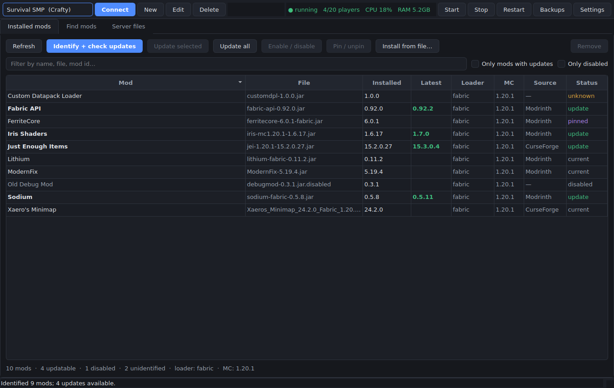
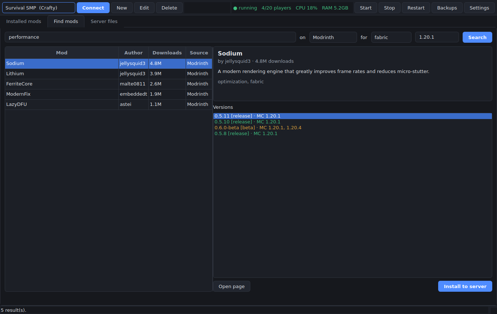
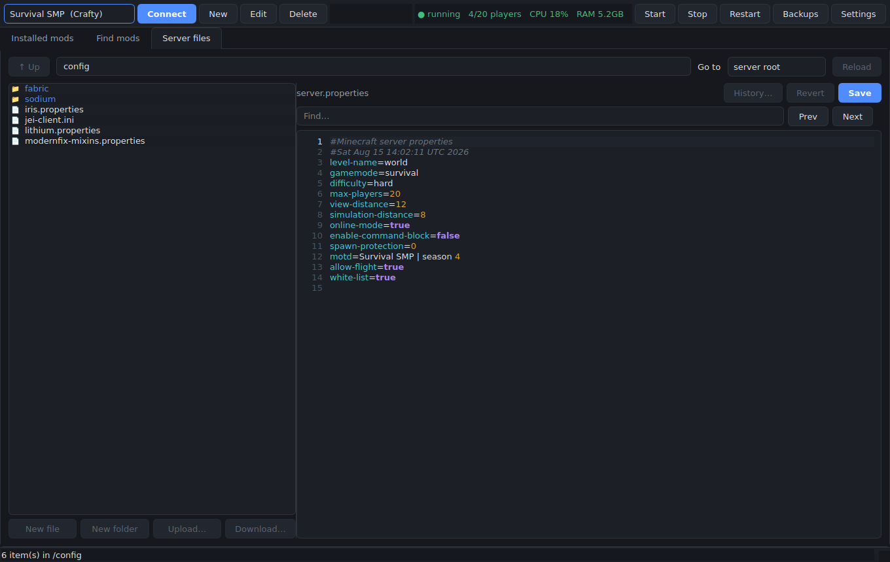

# Crafty Mod Manager

A Windows desktop app for managing a remote Minecraft server's **mods, mod versions, and config files** — over the **Crafty Controller v4 API**, over **SSH/SFTP**, or both, switching per connection.



---

## What it does

**Mods**

- Scans the server's `mods` folder, opens each jar and reads its real identity from `fabric.mod.json`, `quilt.mod.json`, `META-INF/neoforge.mods.toml`, `META-INF/mods.toml` or legacy `mcmod.info` — falling back to filename parsing when a jar ships no descriptor.
- Matches every jar against **Modrinth** (SHA‑1 lookup) and **CurseForge** (murmur2 fingerprint), so it knows what a mod *is* even if you renamed the file.
- Checks for newer builds filtered to your loader and Minecraft version, and shows exactly what would change before you commit.
- Updates one mod, the selected ones, or everything — each replaced jar is copied to a local backup first.
- Enable/disable via the `.disabled` suffix, pin a mod so update checks skip it, remove with a backup, or upload jars you already have.

**Finding mods**

- Search Modrinth and CurseForge, filtered by loader and MC version, pick a specific build (release/beta/alpha are colour-coded) and install straight to the server.
- Warns when a build declares required dependencies, and when the mod is already installed.

**Config files**

- Full remote file browser with an editor that syntax-highlights `.properties`, `.toml`, `.json`, `.yml`, `.cfg`/`.ini`, `.snbt`, `.js` and shell scripts.
- Conflict detection: if the file changed on the server after you opened it, you get asked before overwriting instead of silently clobbering someone else's edit.
- Every save writes a timestamped local backup first, with a **History…** button to load any earlier version back.
- Create, rename, delete, upload and download files and folders.

**Server**

- Start / stop / restart with live status (players online, CPU, RAM) via Crafty, or your own shell commands over SSH.

---

## Requirements

- Windows 10 or 11 (it also runs fine on Linux and macOS — nothing is Windows-specific except the launcher scripts)
- **Python 3.10 or newer** — [python.org/downloads/windows](https://www.python.org/downloads/windows/). During setup, tick **"Add python.exe to PATH"**.
  - Only needed to run from source or to build the `.exe`. Once built, the `.exe` needs nothing installed.

---

## Getting started

### Option A — run it (fastest)

Double-click **`run.bat`**.

The first run creates a private virtual environment in `.venv` and installs the dependencies — about a minute. Every run after that starts immediately. Nothing is installed system-wide.

### Option B — build a standalone `.exe`

Double-click **`build_exe.bat`**.

A few minutes later you'll have **`dist\CraftyModManager.exe`** — one self-contained file you can copy anywhere or pin to the taskbar. No Python needed on the machine that runs it.

> The `.exe` has to be built on Windows; it can't be cross-compiled. That's why it isn't included prebuilt.

---

## Setting up a connection

On first launch the app walks you into the connection dialog. You can save as many connections as you like and switch between them from the dropdown.

### Crafty Controller v4

| Field | What to put in it |
|---|---|
| **Crafty URL** | `https://your-server:8443` — the same address you open the panel with |
| **Authentication** | **API key** is recommended (see below), or username + password |
| **API key** | In Crafty: click your username → **API keys** → create one |
| **Verify the TLS certificate** | Leave **off** unless you've installed a real certificate. Crafty ships a self-signed one, and verification will fail against it. |
| **Server** | Click **Load servers** after entering credentials, then pick from the list |

The API key needs **Files** permission (for mods and configs) and **Commands** permission (for start/stop). Scope it to just the server you want to manage.

If you use username + password and have 2FA enabled, put the current code in the **2FA code** box — it's used once at login and never stored.

### SSH / SFTP

| Field | What to put in it |
|---|---|
| **Host / Port / Username** | Standard SSH details |
| **Authentication** | Password, a private key file, or your SSH agent / default keys |
| **Server folder** | The directory the server runs from, e.g. `/opt/minecraft/survival`. Everything is relative to this and the app will not read or write outside it. |
| **Power commands** | Optional. Whatever restarts your server: `sudo systemctl restart minecraft`, `docker restart mc`, `screen -S mc -X stuff "stop\n"` … Leave blank and the power buttons simply report that none is configured. |

### Server layout (both transports)

| Field | Default | Notes |
|---|---|---|
| **Mods folder** | `mods` | Change it for proxies or unusual layouts |
| **Config folders** | `config, defaultconfigs, kubejs` | Just shortcuts in the file browser |
| **Mod loader** | `auto` | Auto-detected from the installed jars; override if detection is wrong |
| **Minecraft version** | blank | Blank = detect from installed mods |

Hit **Test connection** before saving — it verifies credentials, lists your servers, and (over SSH) checks the mods folder actually exists at that path.

---

## CurseForge

Modrinth works with no setup. CurseForge requires a free API key:

1. Sign in at [console.curseforge.com](https://console.curseforge.com/) → **API Keys**
2. Copy the key
3. In the app: **Settings** → paste it into **CurseForge API key**

Until you do, CurseForge is greyed out in the search dropdown and skipped during identification.

> Some CurseForge authors disable third-party downloads. When that happens the app tells you rather than failing silently — download the jar from the site and use **Install from file…**.

---

## Finding and installing mods



Search is filtered by your detected loader and MC version by default. Set the loader dropdown to **any** to widen it.

Version colours: green = release, amber = beta, red = alpha.

The app installs the jar you picked. It does **not** resolve dependency trees — if a build declares required dependencies you get told how many, and it's on you to install them. This is deliberate: automatic dependency resolution across two platforms with inconsistent metadata is exactly where mod managers break server installs.

---

## Editing configs



Double-click a file to open it. `Ctrl+S` saves. Files over 4 MB won't open in the editor — download them instead.

If the file changed on the server since you opened it, the save is refused and you're asked whether to overwrite. This catches the case where you edited in-game or via the Crafty panel in another tab.

---

## Backups and rolling back

Click **Backups** in the toolbar.

Anything the app replaced or removed is there: every jar it swapped during an update, every jar it deleted, and every config it saved over. **Restore to server** uploads the saved copy back. **Save a copy…** pulls it to your PC instead.

By default 25 versions are kept per file (adjustable in Settings). They live in:

```
%APPDATA%\CraftyModManager\backups\<profile-id>\
```

These are *this app's* safety net, not a server backup strategy. Keep using Crafty's own backups (or whatever you use) for worlds.

---

## Where things are stored

```
%APPDATA%\CraftyModManager\
  config.json      connections and preferences
  craftymm.log     log file — check here first if something misbehaves
  backups\         replaced jars and previous config versions
  cache\           jar hashes and parsed metadata, so rescans are fast
  state\           per-mod pins and resolved project identities
```

**Credentials** go into the **Windows Credential Manager** via `keyring`, not into `config.json`. If the credential store is unreachable, the app falls back to a local `secrets.json` and warns you in the connection dialog and in Settings — in that situation prefer a scoped API key over your account password.

Deleting a connection deletes its stored credentials too.

---

## Keyboard shortcuts

| Key | Action |
|---|---|
| `F5` | Rescan the mods folder |
| `Ctrl+R` | Reconnect |
| `Ctrl+S` | Save the open config file |
| `Enter` in the find box | Find next (wraps) |

---

## Things worth knowing

**Stop the server before updating mods.** The app asks for confirmation, but it can't stop you. Swapping jars under a running server generally means a crash and, with world-affecting mods, possible corruption.

**Crafty uploads go to Crafty's managed server directory.** Crafty's upload endpoint resolves the destination from its own `servers/<server-id>` path rather than the server's configured path. For a normal Crafty-created server these are the same. If you imported a server that lives somewhere custom, uploads may land in the wrong place — use an SSH connection for that server instead.

**Unidentified mods are normal.** Private builds, jars from a modpack that were repackaged, and mods only distributed on a Discord or a personal site won't hash-match anything. They show as `unknown` and are left alone — you can still enable, disable, remove or replace them by hand.

**The `.disabled` convention.** Disabling renames `foo.jar` to `foo.jar.disabled`, which Fabric, Forge, NeoForge and Quilt all ignore.

**Rate limits.** Modrinth and CurseForge both rate-limit. The app batches hash lookups (200 at a time) and retries with backoff, so a few hundred mods is fine, but hammering *Identify* repeatedly may make it pause.

---

## Troubleshooting

**"Could not reach Crafty at …"** — check the URL includes the port (usually `:8443`) and that you can open the panel in a browser from this PC.

**"Crafty returned a non-JSON login response"** — that URL isn't a Crafty panel, or a reverse proxy is intercepting. Try the direct `https://host:8443`.

**TLS / certificate errors** — turn **Verify the TLS certificate** off. Crafty's default certificate is self-signed.

**"Crafty denied that request (401/403)"** — the API key lacks a permission (needs **Files**, plus **Commands** for the power buttons), or it isn't scoped to that server, or it expired.

**"Could not open 'mods' on the server"** — the mods folder path in the connection settings doesn't match the server's layout. Use the **Server files** tab to browse to it and copy the real path.

**SSH power buttons say no command is configured** — that's expected; fill in the power commands in the connection dialog.

**Anything else** — `%APPDATA%\CraftyModManager\craftymm.log`, or run `run.bat --debug` for verbose output.

---

## For developers

```
app.py                    entry point
craftymm/
  config.py               profiles, settings, credential storage
  models.py               dataclasses shared across layers
  modmeta.py              jar descriptor parsing + sha1/sha512/murmur2
  manager.py              scan / identify / update / backup orchestration
  backends/
    base.py               transport-agnostic interface (relative POSIX paths)
    crafty.py             Crafty Controller v2 REST API
    ssh.py                paramiko SFTP + shell
  providers/
    modrinth.py           search, versions, hash lookup, update check
    curseforge.py         search, files, fingerprint match
  ui/                     PySide6: main window, tabs, editor, dialogs, workers
tests/
  test_all.py             backends, providers, manager (68 tests)
  test_ui.py              Qt task delivery and tab wiring, offscreen (13 tests)
  fake_crafty.py          stand-in Crafty v4 API over a real temp directory
  fake_platforms.py       stand-in Modrinth + CurseForge APIs
```

Nothing outside `craftymm/ui` imports Qt, so the backend, providers and manager are usable from a script or a different frontend.

Run the tests:

```
.venv\Scripts\python -m pip install -r requirements-dev.txt
.venv\Scripts\python -m pytest tests -q
```

81 tests, no network access required.

The suite runs the Crafty backend end-to-end against a fake Crafty server that mirrors the real handler semantics (bearer auth, the `{"status": "ok", "data": …}` envelope, the `modified_epoch` 409 conflict rule, and the header-driven chunked upload protocol), plus fake Modrinth/CurseForge APIs for the full scan → identify → update → install → roll back flow. The murmur2 implementation is verified byte-for-byte against the reference C implementation.

`test_ui.py` runs Qt offscreen and covers the things unit tests can't reach: that background-task callbacks are actually delivered, that `done` arrives before `finished` (which is what makes the `defer()` chaining correct), that a failed task still clears the busy flag, and that a delete/create refreshes the view afterwards. The data-loss paths have explicit regression tests — a backup that can't be written aborts the operation instead of proceeding, a forced overwrite saves the *live* remote version rather than the stale editor copy, updating a disabled mod keeps it disabled, and a failed SFTP upload leaves the original file intact.

Endpoints used, verified against `crafty-controller/crafty-4` at `master`:

```
POST   /api/v2/auth/login
GET    /api/v2/servers/
GET    /api/v2/servers/{id}/stats/
POST   /api/v2/servers/{id}/action/{action}
POST   /api/v2/servers/{id}/files              list a directory or read a file
PATCH  /api/v2/servers/{id}/files              write a file
DELETE /api/v2/servers/{id}/files              delete
PUT    /api/v2/servers/{id}/files/create       create file or folder
PATCH  /api/v2/servers/{id}/files/create       rename
POST   /api/v2/servers/{id}/files/(move|copy)
GET    /api/v2/servers/{id}/files/{path}/download
POST   /api/v2/servers/{id}/files/upload       plain and chunked
```

---

## Licence

MIT. Use it, change it, ship it.
